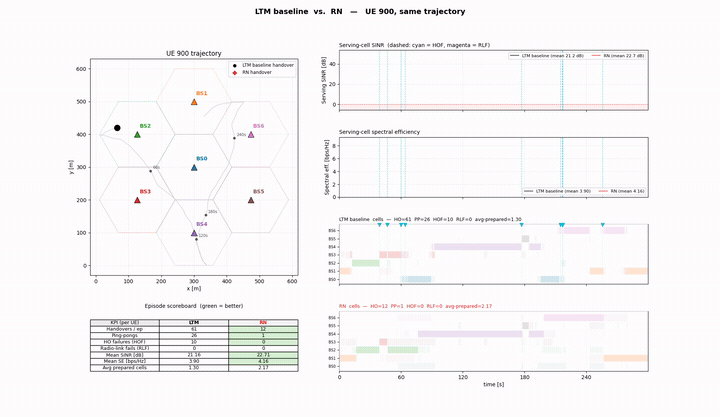
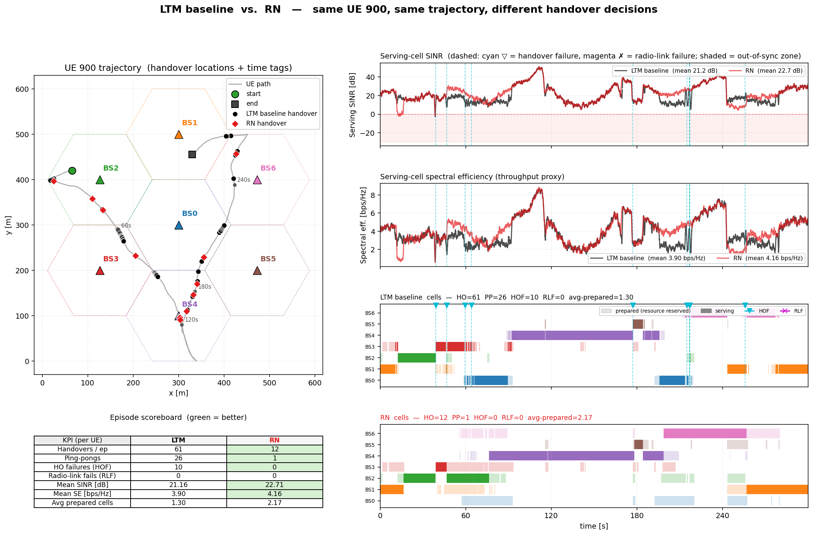
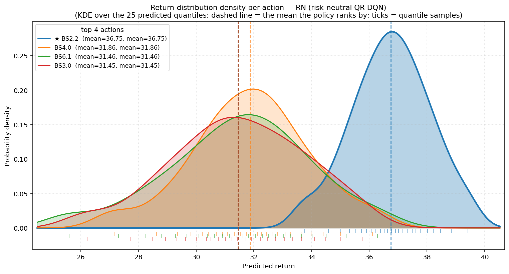
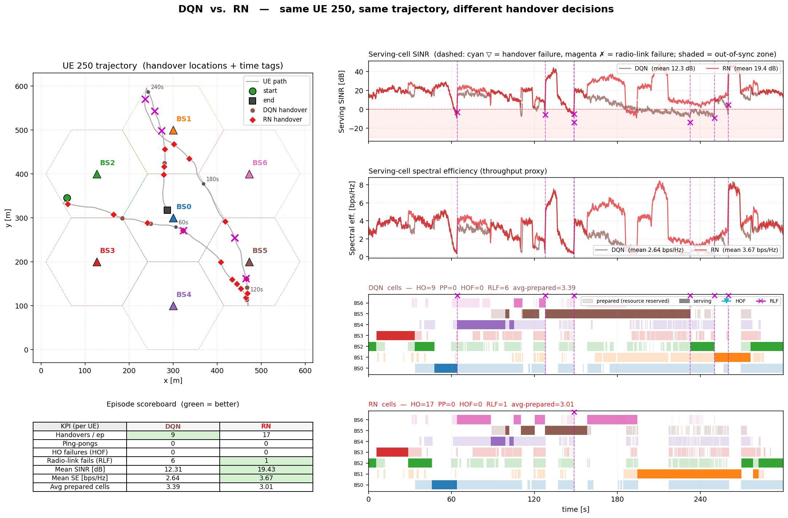
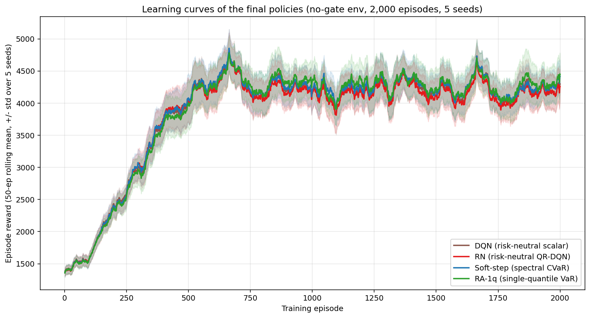

# Distributional Reinforcement Learning for 5G-Advanced Handover

Applying **Distributional Reinforcement Learning** (DQN vs. **QR-DQN**) to
**Lower Layer Triggered Mobility (LTM)** handover decisions in 5G/6G. Standard
RL optimizes the *expected* return; distributional RL models the **full
distribution** of returns — which lets the policy be **risk-aware** (CVaR), a
natural fit for highly variable radio links. On a high-fidelity multi-sector
deployment (7 BS × 3 sectors, 1,000 pre-computed UE trajectories) the learned
agents beat both a standardized LTM heuristic and a published contextual-bandit
(CMAB) reference across the KPI envelope.

<p align="center">
  <br>
  <sub><b>Same UE, same trajectory, two policies.</b> Left: the UE path with each
  policy's handover locations. Right: serving SINR &amp; throughput (one line per
  policy), the per-policy <i>prepared</i> (light) / <i>serving</i> (solid) cell
  rasters, and a live KPI scoreboard. The LTM heuristic (black) thrashes between
  cells; our QR-DQN agent (red) stays on far fewer, better links.</sub>
</p>

## Results at a glance

<table>
<tr>
<td width="50%" valign="top">
  <br>
  <sub><b>Headline KPIs.</b> All nine metrics vs. the LTM heuristic and the
  published CMAB bandit — the learned agents lead the envelope (fewer handovers,
  ping-pongs and failures at equal-or-better capacity &amp; reliability).</sub>
</td>
<td width="50%" valign="top">
  <br>
  <sub><b>Head-to-head on one trajectory.</b> On UE 900 the agent does 12
  handovers vs. 61, 1 ping-pong vs. 26, 0 handover-failures vs. 10, and 0
  radio-link failures — at <i>higher</i> SINR and spectral efficiency.</sub>
</td>
</tr>
<tr>
<td width="50%" valign="top">
  <br>
  <sub><b>Why distributional RL helps.</b> Each candidate cell's return as a
  probability density; the agent prefers the one sitting highest. The dashed
  line is the value the policy ranks by — the <i>mean</i> here, or the <i>CVaR
  in the left tail</i> for a risk-averse agent.</sub>
</td>
<td width="50%" valign="top">
  <br>
  <sub><b>The risk frontier.</b> Reward per decision vs. tail failures for three
  ways to dial risk aversion (single-quantile, hard-CVaR, soft-step) — a clean
  trade-off curve, efficient toward the upper-left.</sub>
</td>
</tr>
<tr>
<td width="50%" valign="top">
  <br>
  <sub><b>The DQN → RN step.</b> On UE 250 scalar DQN crashes into outage six
  times (six radio-link failures at ~12 dB); the distributional agent cuts that
  to one and gains +7 dB.</sub>
</td>
<td width="50%" valign="top">
  <br>
  <sub><b>Risk-awareness is (almost) free.</b> Every final policy converges to
  nearly the same training return — risk-awareness reshapes the KPI profile
  without sacrificing reward.</sub>
</td>
</tr>
</table>

> More figures and the animations for every policy pair live in
> [`figures/`](figures/) (generated locally; see its README). The two figures in
> the paper are in [`paper/`](paper/).

## The idea in one minute

A handover policy must, at each decision, pick which cell to serve the user. The
return of that choice is **random** — it depends on how the radio channel
evolves. A scalar agent (DQN) only tracks the *average* return; **QR-DQN**
learns the whole return **distribution** as a set of quantiles. With the
distribution in hand the agent can rank cells not just by their mean but by a
**risk measure** — e.g. CVaR, the average of the worst-case tail — which steers
it away from links likely to drop. That risk-awareness is what trims the
handover-failure and radio-link-failure tails without giving up throughput.

## Project goals

1. Benchmark DQN, QR-DQN, and a hardcoded LTM baseline on a high-fidelity 5G
   sectored deployment (7 BS × 3 sectors, 1,000 pre-computed UE trajectories).
2. Track 8 scientific metrics: capacity, RLF rate, HO rate, ping-pong rate,
   reliability, cell-preparation rate, resource reservation, HOF rate.
3. Compare against the published LTM-CMAB paper numbers under matched physics
   (TxPower = 25 dBm, 26-step SINR table, etc.).
4. Explore risk-aware variants (CVaR-QR-DQN) for stability-critical mobility.

## Repository layout

```
src/distrl/      Core framework
  agents/        BaseAgent + DQN, QR-DQN, LTM heuristic baseline, replay buffer
  envs/          Gymnasium env, legacy reference simulator, shared physics
  viz/           Learning-curve plots + MP4 dashboard animation
  utils/         Config, metrics, evaluation
src/tools/       Standalone CLI utilities, incl. the figure generators
src/scripts/     Smoke / verification scripts (see CLAUDE.md)
src/main.py      Training entrypoint
configs/         YAML configs (see configs/README.md)
data/            Channel-gain dataset (raw .mat + precomputed .npz cache)
docs/            Reference docs + README showcase assets (docs/assets/)
paper/           LaTeX manuscript + its figures (see paper/README.md)
results/         Training / eval / animation outputs (see results/README.md)
figures/         Curated presentation figures + animations (generated locally,
                 git-ignored; see figures/README.md)
```

For deeper guidance, see **`CLAUDE.md`** (architecture, commands, parity
decisions) and **`paper/`** (the manuscript this code supports).

## Getting started

```bash
# 1. One-time setup (creates venv-RL, installs deps)
python3 -m venv venv-RL
./venv-RL/bin/pip install -r requirements.txt

# 2. Set PYTHONPATH (every shell)
export PYTHONPATH=$PYTHONPATH:$(pwd)/src

# 3. Generate the precomputed dataset (one-time)
./venv-RL/bin/python3 src/tools/preprocess_dataset.py

# 4. Run a benchmark (DQN + QR-DQN, multi-seed, auto eval + plots)
./venv-RL/bin/python3 src/main.py --config configs/config.yaml \
    --device cpu --description my-run
```

Outputs land in `results/benchmarks/bmk_<date>_<num>_<desc>/`; frozen-weight
post-training evaluation runs automatically at the end of each seed.

## Reproducing the figures

The graphics above are all regenerable from the committed results (export
`PYTHONPATH` first):

```bash
# Single-trajectory policy comparison (any two of: ltm, dqn, rn, softstep, ra1q, ra)
./venv-RL/bin/python3 src/tools/plot_policy_comparison.py --a ltm --b rn --ue 900
./venv-RL/bin/python3 src/tools/plot_policy_comparison.py --a ltm --b rn --ue 900 --animate
./venv-RL/bin/python3 src/tools/gen_head_to_head_set.py        # the whole set

# Distributional / aggregate views
./venv-RL/bin/python3 src/tools/plot_return_density.py
./venv-RL/bin/python3 src/tools/plot_finals_learning_overlay.py
./venv-RL/bin/python3 src/tools/generate_final_plots.py
./venv-RL/bin/python3 src/tools/plot_risk_frontier.py
```

See [`figures/README.md`](figures/README.md) for the full catalogue and a
suggested presentation order.

## Performance

The env is heavily optimized for research-scale iteration: a precomputed
channel-gain `.npz` cache (hashed against the active physics constants),
vectorized SINR / MCS / HOF math in `src/distrl/envs/physics.py`, and O(1)
moving-average state computations. Use `--device cpu`: `main.py` parallelizes
seeds across CPU cores, which on these small MLPs is substantially faster than
the single-seed Intel iGPU (`xpu`) path. See `CLAUDE.md` for the measured
comparison.

## Paper

This repository accompanies the manuscript **"Risk-Aware Distributional
Reinforcement Learning for 5G-Advanced Handover Decisions"** (G. Grau Garcia).
The LaTeX source and figures are in [`paper/`](paper/), along with the talk
deck ([`paper/slides.pdf`](paper/slides.pdf)).

## License

MIT — see the [`LICENSE`](LICENSE) file.
