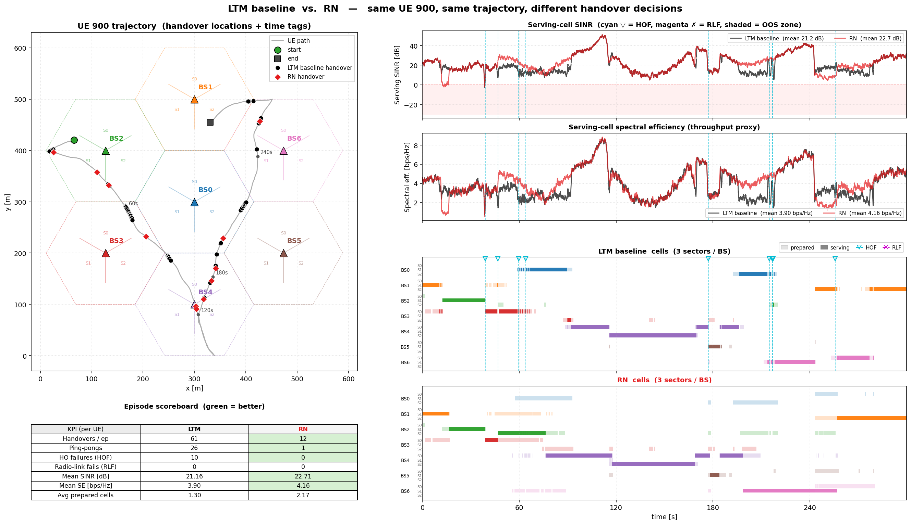
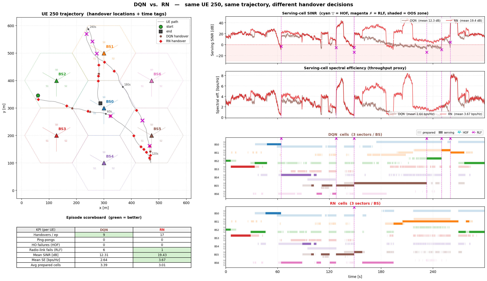
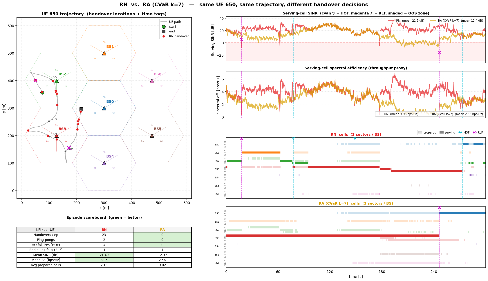
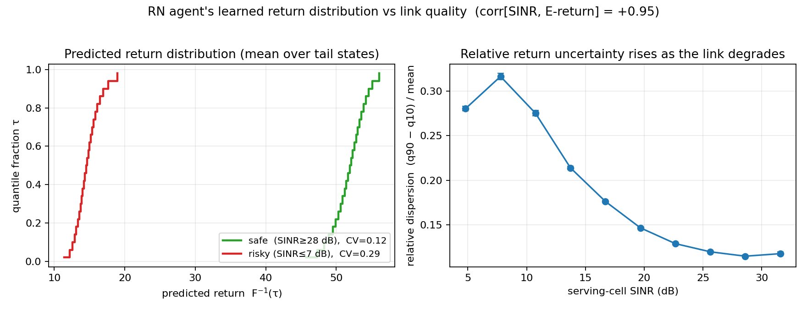
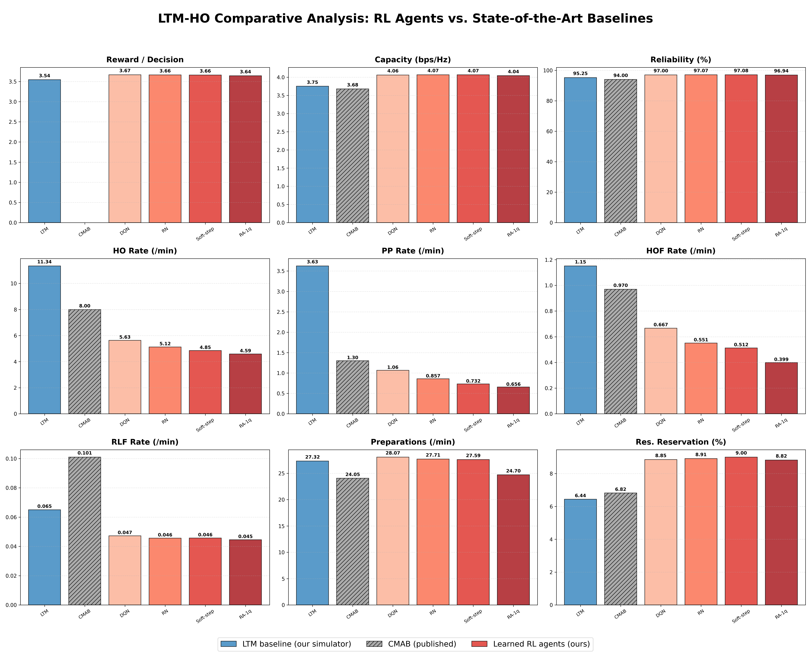
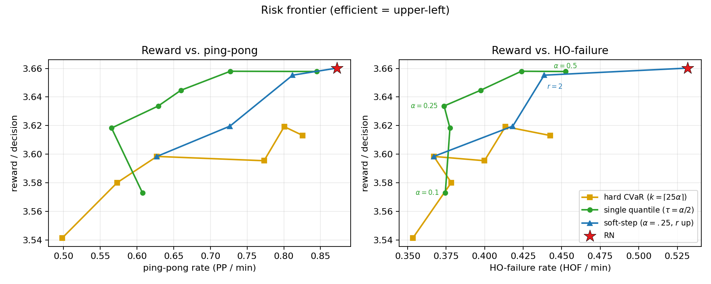

# Presentation figures

Curated, presentation-ready graphics and animations for **"Risk-Aware
Distributional Reinforcement Learning for 5G-Advanced Handover Decisions."**
Everything here is generated from the committed results — nothing is hand-edited.

> **What's in the repo:** the **PNGs are tracked**; the **MP4 animations are
> not** (~119 MB, git-ignored via `.gitignore`). The `.mp4` links below work
> once you regenerate them locally — see [Regenerating](#regenerating).

> **KPI order** used throughout: Reward · Capacity · Reliability · HO · PP ·
> HOF · RLF · Prep · Reservation. Reward is always *reward per decision*.
>
> **Agent roster** (no-gate event-driven env): **DQN** (scalar baseline) →
> **RN** (risk-neutral QR-DQN) → **Soft-step** / **RA-1q** / **RA** (risk-aware
> CVaR variants). **LTM** = the standardized heuristic baseline; **CMAB** = the
> published bandit reference.
>
> **Reserved colours** — a policy looks the same in every figure (head-to-head,
> the finals learning overlay, and the risk frontier): LTM = ■ black,
> DQN = ■ brown, RN = ■ red, RA / hard-CVaR = ■ amber, Soft-step = ■ blue,
> RA-1q = ■ green. Failures are dashed verticals + icons in colours used by
> nothing else: **HOF = cyan ▽**, **RLF = magenta ✗**.

---

## ⭐ Start here — the highlights

### 1. One policy vs another, on a single trajectory (the clearest slide)

Both policies run on the **same** precomputed UE, so it's a like-for-like
comparison of *decisions*. Top-right: serving SINR and spectral efficiency (two
lines, one per policy). Bottom-right: per-policy cell rasters (**light =
prepared / reserved, solid = serving**) — every handover is the solid block
hopping rows. Failures are dashed verticals (**cyan ▽ = HOF, black ✗ = RLF**).
The scoreboard (green = better) summarises the per-UE KPIs.



**LTM vs RN, UE 900** — the agent dominates on every axis: 12 handovers vs 61,
1 ping-pong vs 26, 0 HOF vs 10, 0 RLF, at *higher* SINR and throughput.
▶ **Animated version:** [`09_head_to_head/ltm_vs_rn/ltm_vs_rn_ue900.mp4`](09_head_to_head/ltm_vs_rn/ltm_vs_rn_ue900.mp4)
(a time cursor sweeps the episode; lines and map reveal progressively).

### 2. The improvement, step by step (DQN → RN → RA)

 

- **DQN → RN (UE 250):** scalar DQN crashes into outage **6 times** (6 RLFs at
  12 dB); the distributional RN cuts that to **1 RLF and gains +7 dB**. *What
  distributional RL buys you.*
- **RN → RA (UE 650):** RN does 23 handovers, **4 of which fail**; the
  risk-averse RA refuses nearly all of them (**0 HO, 0 HOF**) — textbook
  risk-aversion (with an honest throughput cost; the population-level payoff is
  the risk frontier below).

### 3. Why distributional RL helps — the return distribution

 

- **Density per action (left):** each candidate cell's return distribution as a
  smooth density; the agent picks the one whose mass sits highest. The dashed
  line is the value the policy *ranks by* — the **mean** for RN, and (in
  [`return_density_cvar_ue500.png`](03_risk_and_distributions/return_density_cvar_ue500.png))
  the **CVaR in the left tail** for the risk-averse agent.
- **Risk perception (right):** the agent's return distribution is **tight in
  safe states, wide in risky ones** (corr[SINR, E-return] = +0.95) — it learns
  to *see* radio risk.

### 4. The aggregate result and the risk frontier

 

- **Master KPIs (left):** RL beats LTM and CMAB across the envelope.
- **Risk frontier (right):** reward vs failures for the three risk mechanisms —
  this is where the RN→RA "step" pays off at the population level.

### 5. They learn, and risk-awareness is (almost) free


All final policies converge to nearly the same return — risk-awareness reshapes
the KPI profile without sacrificing reward.

---

## Full index by folder

| Folder | Contents |
| --- | --- |
| `01_headline_results/` | `master_bar_plots.png` (3×3, labelled), `master_bar_plots_1col.png` (paper), `master_radial_plot.png` (radar). |
| `02_learning_curves/` | `finals_learning_overlay.png` (+`_all`), per-agent `*_learning_curve.png` / `*_reward_vs_walltime.png`, `headline_variants_study.png`. |
| `03_risk_and_distributions/` | `return_density_ue500.png` + `return_density_cvar_ue500.png` (PDF view), `return_distributions.png`, `risk_frontier.png` / `risk_frontier_2panel.png`, `per_ue_tails.png`, `quantile_compare_midpoint_vs_cvar.png`, `quantile_dist_*.png`, `{rn,softstep,ra1q,ra}_learned_quantiles.png`. |
| `04_parameter_studies/` | `quantile_mode_study.png`, `cvar_alpha_sweep.png`, `kappa_sweep.png`, `n_sweep.png`. |
| `05_metrics_grids/` | `{dqn,rn,softstep,ra1q}_metrics_grid.png` — full per-run KPI panels (appendix). |
| `06_atari_validation/` | `atari_Pong_study.png`, `atari_Boxing_study.png` — the method generalizes. |
| `07_animations/` | `side_by_side/` (LTM vs QR-DQN, pre-stitched), `2000ep_finals/` (single-agent clips), `k10_finals_ue500/` (5 agents on one UE). |
| `08_paper_figures/` | `paper.pdf` + the two frozen manuscript figures. |
| `09_head_to_head/` | The single-trajectory comparisons. Four progression pairs — `ltm_vs_dqn`, `dqn_vs_rn`, `rn_vs_ra`, `ltm_vs_rn` — each rendered for **UE 250, 650, 900** as both a static PNG and an animated MP4 (12 + 12). Regenerate the whole set with `src/tools/gen_head_to_head_set.py`. |
| `10_single_policy/` | One algorithm **by itself** (no comparison) — map + scoreboard, serving SINR/SE, and one per-sector cell raster. Use it to introduce the environment / the LTM baseline. Rendered for **UE 250, 650, 900** as PNG + MP4. Regenerate with `src/tools/gen_single_policy_set.py` (or `plot_policy_comparison.py --a ltm --single --ue 900 [--animate]`). |

---

## Suggested slide arc

1. **Problem** — dense 5G handover; failures/ping-pongs hurt reliability.
   (`07_animations/side_by_side/ltm_vs_qrdqn_ue500.mp4`)
2. **Idea** — model the *distribution* of returns → risk-aware selection.
   (`03_.../return_density_ue500.png`, `return_distributions.png`)
3. **Headline result** — RL beats LTM and CMAB. (`01_headline_results/*`)
4. **On a single trajectory** — (`09_head_to_head/ltm_vs_rn_ue900.png` / `.mp4`)
5. **Step by step** — DQN→RN→RA. (`09_head_to_head/dqn_vs_rn_ue250.png`, `rn_vs_ra_ue650.png`)
6. **Risk frontier + unlucky users** — (`03_.../risk_frontier_2panel.png`, `per_ue_tails.png`)
7. **They learn / risk is free** — (`02_.../finals_learning_overlay.png`)
8. **Robustness + generalization** — (`04_parameter_studies/*`, `06_atari_validation/*`)

---

## Regenerating

From the repo root, with `PYTHONPATH` exported (see `CLAUDE.md`):

```bash
export PYTHONPATH=$PYTHONPATH:$(pwd)/src

# Head-to-head comparisons (any two policies: ltm, dqn, rn, softstep, ra1q, ra)
./venv-RL/bin/python3 src/tools/plot_policy_comparison.py --a ltm --b rn --ue 900
./venv-RL/bin/python3 src/tools/plot_policy_comparison.py --a ltm --b rn --ue 900 --animate

# ...or the whole presentation set in one go (4 pairs x 3 UEs + 12 videos):
./venv-RL/bin/python3 src/tools/gen_head_to_head_set.py

# Single policy by itself (environment / baseline intro): PNG + MP4 per UE
./venv-RL/bin/python3 src/tools/plot_policy_comparison.py --a ltm --single --ue 900
./venv-RL/bin/python3 src/tools/gen_single_policy_set.py      # ltm on UE 250/650/900

# Return-distribution density (PDF) view
./venv-RL/bin/python3 src/tools/plot_return_density.py --ue-idx 500

# Aggregate plots
./venv-RL/bin/python3 src/tools/plot_finals_learning_overlay.py
./venv-RL/bin/python3 src/tools/generate_final_plots.py
./venv-RL/bin/python3 src/tools/plot_risk_frontier.py
./venv-RL/bin/python3 src/tools/plot_return_distributions.py
./venv-RL/bin/python3 src/tools/plot_per_ue_tails.py
```

Other figures were copied from `results/final_metrics/plots/`,
`results/benchmarks/<final-run>/figures/`, and `results/animations/`.
The PNGs in this folder are tracked; the MP4 animations are git-ignored
(`*.mp4`, ~119 MB) and regenerate from the commands above.
